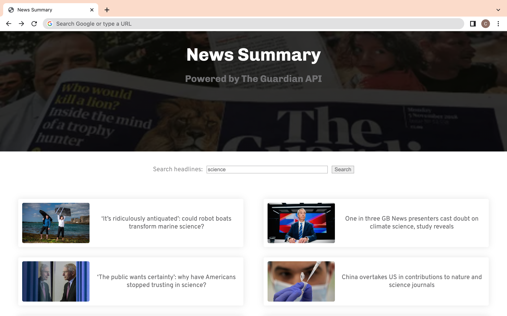

# News challenge

A Guardian API app made as part of the Makers Academy Software Development course.

## Project overview

The app grabs all the headlines from the Guardian newspaper API and displays them on a
page. Clicking on a headline will link the user to the actual article page on the Guardian's website.

## Learning objectives

- TDD a Javascript program running in a web browser, using modern JS build tools.
- Use the DOM to manipulate the web page structure and content.
- Use fetch to send HTTP requests to an API.
- Use jest mocking functionality to test drive an API class.

### Technologies

- JavaScript
- Jest
- [`jest-fetch-mock`](https://www.npmjs.com/package/jest-fetch-mock) module
- `esbuild` build tool
- HTML
- CSS

## User Stories

```
As a busy politician
So I know what the big stories of the day are
I can see all of today's headlines in one place
```

```
As a busy politician
So that I have something nice to look at
I can see a relevant picture to illustrate each news article when I browse headlines
```

```
As a busy politician
So I can get a few more details about an important story
I can click a news article title which links to the original article
```

```
As a busy politician
So I can search what I want to read about
I can specify a search query on the page and get articles matching this search
```

## Headlines page



## API

### API authentication

Need to [register and get an API
key](https://open-platform.theguardian.com/access/) to use the Guardian API.

## Resources

- [Guardian newspaper API homepage](http://open-platform.theguardian.com/documentation/)
- [Postman](https://www.postman.com/downloads/?utm_source=postman-home), a program to send and test HTTP requests
